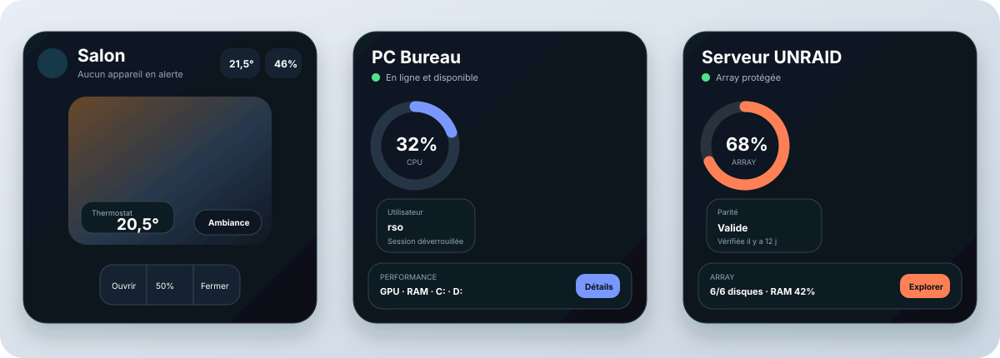

# Auralis Cards

Auralis Cards est une collection de cartes modernes pour Home Assistant : navigation entre les sous-vues, pièce tout-en-un, groupes de volets, éclairage, thermostats, frigo connecté, suivi d’un PC, supervision d’un serveur UNRAID et pilotage d’un nœud Proxmox. Son langage graphique, **Auralis Frame**, associe photographie immersive, informations flottantes et surfaces vitrées.



## Cartes disponibles

- `custom:auralis-room-card`
- `custom:auralis-covers-card`
- `custom:auralis-navbar-card`
- `custom:auralis-pc-card`
- `custom:auralis-unraid-card`
- `custom:auralis-proxmox-card`
- `custom:auralis-lights-card`
- `custom:auralis-thermostat-card`
- `custom:auralis-fridge-card`

Thèmes : `auto`, `halo`, `carbon`, `mono`, `aurora`.

Le design cinématique accepte une image locale facultative avec `background_image`. Placez l'image dans `config/www/`, puis utilisez une URL `/local/...`. Sans image, une ambiance abstraite sombre est affichée automatiquement.

Les cartes **Pièce, PC et UNRAID** partagent le même système de fond :

```yaml
card_background:
  mode: gradient # solid, gradient ou grid
  gradient: "linear-gradient(145deg, #09111A 0%, #0D1822 58%, #081018 100%)"
show_grid: false # true affiche la trame décorative
```

Les cartes techniques acceptent aussi une image superposée :

```yaml
background_image: /local/auralis-cards/images/machine.jpg
background_position: 50% center
accent_color: "#50d59b"
image_brightness: 72
glass_opacity: 0.84
```

`card_background.color` est utilisé avec `mode: solid` ou `mode: grid`. `card_background.gradient` est utilisé avec `mode: gradient`. `show_grid` permet d'afficher ou masquer les lignes sans changer le fond choisi.

Le [cahier des charges](docs/CAHIER_DES_CHARGES.md) décrit le périmètre et les choix fonctionnels.

## Développement

```bash
npm install
npm run dev
npm run verify
```

Toutes les cartes sont enregistrées dans le point d'entrée TypeScript [`auralis-cards.ts`](auralis-cards.ts). Le bundle unique est généré dans `dist/auralis-cards.js`.

## Installation avec HACS

Une fois le dépôt public créé :

1. Ouvrir **HACS** dans Home Assistant.
2. Ouvrir le menu à trois points puis **Dépôts personnalisés**.
3. Coller l'URL GitHub du dépôt `https://github.com/renaldsouder/auralis-cards`.
4. Choisir la catégorie **Dashboard** puis ajouter le dépôt.
5. Télécharger **Auralis Cards** et actualiser le navigateur.

La ressource distribuée par HACS sera disponible sous `/hacsfiles/auralis-cards/auralis-cards.js`. Ce chemin évite le cache persistant utilisé par `/local/`.

Si Home Assistant affiche `Custom element doesn't exist`, vérifiez dans **Paramètres → Tableaux de bord → ⋮ → Ressources** que cette URL est déclarée comme **module JavaScript**, puis rechargez la page. Coller le YAML d'une carte ne charge pas la ressource JavaScript.

## Installation manuelle

1. Copier `dist/auralis-cards.js` dans `config/www/auralis-cards/`.
2. Ajouter `/local/auralis-cards/auralis-cards.js` comme ressource JavaScript de type `module`.
3. Rafraîchir Home Assistant.

Les anciens types `custom:orbit-*` restent temporairement reconnus par le bundle Auralis afin de faciliter la migration. Les nouvelles configurations doivent utiliser `custom:auralis-*`.

Chaque GitHub Release contenant `auralis-cards.js` devient une version sélectionnable et met à disposition les mises à jour dans HACS.

Le fichier `examples/dashboard.yaml` est une configuration complète à coller dans l'éditeur de configuration brute du dashboard. Les blocs commençant directement par `type: custom:...` sont, eux, destinés à l'éditeur YAML d'une carte individuelle.

Lumières, Thermostats et Frigo utilisent le même `auralis-cards.js` que les autres cartes. Leurs configurations sont dans [Lumières](examples/lights-card.yaml), [Thermostats](examples/thermostat-card.yaml) et [Frigo connecté](examples/fridge-card.yaml). Pour le fond du frigo, copiez [frigo-connecte.jpg](images/frigo-connecte.jpg) dans `config/www/auralis-cards/images/`, puis remplacez les identifiants d'entités par ceux de votre appareil. Voir les guides [Lumières](docs/LIGHTS_CARD.md), [Thermostats](docs/THERMOSTAT_CARD.md) et [Frigo](docs/FRIDGE_CARD.md).

## Exemple minimal — Navigation

Une configuration autonome est disponible dans [`examples/navbar-card.yaml`](examples/navbar-card.yaml).

```yaml
type: custom:auralis-navbar-card
theme: carbon
position: bottom
height_desktop: 76
height_tablet: 72
height_mobile: 72
accent_color: "#79D6F2"
show_labels: true
items:
  - label: Accueil
    icon: mdi:home-outline
    path: /dashboard-auralis/accueil
  - label: Pièces
    icon: mdi:floor-plan
    path: /dashboard-auralis/pieces
    active_paths:
      - /dashboard-auralis/salon
      - /dashboard-auralis/cuisine
  - label: Systèmes
    icon: mdi:server-network
    path: /dashboard-auralis/systemes
    badge_entity: sensor.systemes_en_alerte
```

`position` place la barre au bord visible de l'écran : `top`, `bottom`, `left` ou `right`. Le placement par défaut est `bottom` ; `inline` conserve la carte dans le flux du dashboard. Les placements horizontaux sont centrés dans la zone du tableau de bord, même avec la barre latérale Home Assistant ouverte. Les positions latérales empilent les boutons verticalement. `height_desktop` s'applique au-delà de 1024 px, `height_tablet` entre 601 et 1024 px et `height_mobile` jusqu'à 600 px. Chaque hauteur est un entier de 56 à 160 pixels ; les valeurs par défaut sont 76, 72 et 72 px. `path` cible une vue ou une sous-vue interne Home Assistant. Une entrée reste active dans ses sous-routes ; `exact: true` limite l’état actif à la route exacte. `active_paths` associe plusieurs sous-vues au même bouton. `show_labels: false` produit une barre uniquement composée d’icônes.

En mode édition, la navbar reste une carte normale dans la grille pour pouvoir la sélectionner et la déplacer. Elle se fixe au bord choisi dès la sortie de l'éditeur.
Si son ancien emplacement réserve encore une ligne dans une vue Sections, mettez `grid_options.rows: auto` sur la carte navbar existante.

## Exemple minimal — Pièce

Dans une vue Sections, la carte Pièce suit sa hauteur réelle. Si une carte existante garde une zone vide, remplacez un éventuel `grid_options.rows` enregistré par `auto` dans sa configuration :

```yaml
grid_options:
  columns: 12
  rows: auto
```

Une version autonome, limitée à la carte Salon, est disponible dans [`examples/salon-card.yaml`](examples/salon-card.yaml).

```yaml
type: custom:auralis-room-card
name: Salon
theme: carbon
card_background:
  mode: gradient
  gradient: "linear-gradient(145deg, #09111A 0%, #0D1822 58%, #081018 100%)"
show_grid: false
# Une photographie de salon est intégrée par défaut.
# background_image: /local/auralis-cards/images/salon.jpg
background_position: center
accent_color: "#79d6f2"
temperature_entity: sensor.salon_temperature
humidity_entity: sensor.salon_humidity
climate_entity: climate.salon
media_player_entity: media_player.salon
ambiance:
  label: Ambiance
  icon: mdi:creation-outline
  position: bottom-right
scenes:
  - entity: scene.soiree_salon
    label: Mode soirée
    icon: mdi:weather-night
  - entity: scene.normal_salon
    label: Mode normal
    icon: mdi:lightbulb-group-outline
popup_titles:
  lights: Éclairage
  covers: Volets
  climate: Température et humidité
  media: Musique
  tv: Télévision
  ambiance: Choisir une ambiance
left_controls:
  - type: lights
    label: Lumières
    icon: mdi:ceiling-light-outline
right_controls:
  - type: media
    entity: media_player.salon
    label: Musique
    icon: mdi:music-note
  - type: tv
    entity: media_player.tv_salon
    label: TV
    icon: mdi:television
thermostat:
  entity: climate.salon
  position: bottom-left
  label: Thermostat
  step: 0.5
  show_border: true
  show_background: true
  label_color: "#B9C6D5"
  value_color: "#FFFFFF"
  button_color: "#79D6F2"
  background_color: "rgba(13, 18, 25, 0.78)"
  border_color: "rgba(121, 214, 242, 0.28)"
entity_labels:
  light.plafonnier_salon: Plafonnier
  light.lampadaire_salon: Lampadaire
  cover.baie_salon: Baie vitrée
  cover.fenetre_salon: Fenêtre
  sensor.salon_temperature: Température
  sensor.salon_humidity: Humidité
  climate.salon: Thermostat
  media_player.salon: Enceinte du salon
climate_popup:
  graph_entities:
    - sensor.salon_temperature
    - sensor.salon_humidity
  graph_period: 7
  graph_period_unit: days
  show_overview: true
  show_current_values: false
  show_thermostat: true
lights:
  - light.plafonnier_salon
  - light.lampadaire_salon
covers:
  - cover.baie_salon
  - cover.fenetre_salon
```

La pop-up Volets propose uniquement les commandes **Ouvrir**, **Stop** et **Fermer**, pour le groupe comme pour chaque volet. Aucun positionnement en pourcentage n'est affiché.

`card_background.mode` accepte `grid`, `solid` ou `gradient`. Un fond uni utilise `card_background.color`. Un fond dégradé utilise une valeur CSS dans `card_background.gradient`, par exemple `linear-gradient(135deg, #0D151D, #183044)`.
Les valeurs de `entity_labels` remplacent uniquement les libellés affichés par la carte ; les noms des entités Home Assistant restent inchangés. Toute entité absente de cette liste conserve automatiquement son nom Home Assistant. L'ancien champ `cover_labels` reste accepté.

La pop-up Lumières contient une commande générale compacte, une luminosité générale, puis les commandes unitaires. Les éclairages annonçant un mode couleur compatible dans Home Assistant disposent automatiquement d'un sélecteur de couleur global et individuel. Une lumière allumée utilise une icône pleine avec un halo de sa couleur actuelle.

`left_controls` et `right_controls` acceptent chacun jusqu'à deux commandes. Une commande unique est centrée verticalement ; deux commandes sont empilées. Les types disponibles sont `lights`, `covers`, `climate`, `media`, `tv`, `scene` et `entity`. Le type `tv` ouvre une pop-up dédiée avec alimentation, lecture/pause, volume et accès aux détails.

`thermostat` affiche sur la photographie la consigne du thermostat et les boutons −/+. Son libellé, son pas de réglage et toutes ses couleurs sont configurables. `show_border: false` masque la bordure et `show_background: false` rend le fond entièrement transparent, sans flou résiduel. `position` accepte `top-left`, `top-right`, `bottom-left` ou `bottom-right`.

`ambiance` configure l'unique bouton affiché sur la photographie : son `label`, son `icon` et sa `position` (`top-left`, `top-right`, `bottom-left` ou `bottom-right`). Un clic ouvre une petite pop-up. La liste `scenes` fournit les modes proposés dans cette pop-up ; chaque entrée possède sa propre `entity`, son `label` et son `icon`. L'ancien `scene_entity` reste accepté et produit un bouton « Ambiance » contenant le mode « Mode soirée ». Le fichier [`examples/salon-card-complete.yaml`](examples/salon-card-complete.yaml) reprend les identifiants réels fournis pour la carte Salon ; seule l'entité de télévision doit être remplacée par son identifiant réel.

`popup_titles` personnalise le titre de chaque pop-up. La section `climate_popup` choisit les capteurs représentés, génère un graphe séparé par capteur et règle la période avec `graph_period_unit: hours`, `days` ou `months`. Un mois correspond à 30 jours dans le graphe d'historique Home Assistant. Une liste `graph_entities: []` désactive les graphes ; les options `show_overview`, `show_current_values` et `show_thermostat` permettent de composer librement le contenu. Les cartes de valeurs actuelles sont masquées par défaut, car le résumé « Confort de la pièce » contient déjà ces mesures.

## Carte Volets

La carte `custom:auralis-covers-card` affiche directement les groupes sous forme de grandes tuiles photographiques. Le nom est placé en haut à côté de l'icône ; l'état et le chevron apparaissent au-dessus de trois commandes par icône : monter, arrêter et descendre. Les libellés restent accessibles aux lecteurs d'écran et au survol. Un clic sur la zone photographique ouvre la pop-up du groupe avec les commandes groupées et individuelles. Les quatre photographies de la proposition sont intégrées au bundle ; `background_image` dans un groupe permet de remplacer sa photo par une URL `/local/...`. `background_position` règle son cadrage. Le `background_image` de la carte sert d'image commune aux groupes qui n'ont pas leur propre photo.

Une configuration prête à adapter se trouve dans [`examples/volets-card.yaml`](examples/volets-card.yaml) :

```yaml
type: custom:auralis-covers-card
theme: carbon
groups:
  - name: Salon
    covers:
      - cover.baie_salon
      - cover.fenetre_salon
  - name: Bureau
    covers:
      - cover.fenetre_bureau
      - cover.velux_bureau
```

Les quatre photos intégrées se répètent si davantage de groupes sont configurés. Les entités absentes ou indisponibles restent visibles, et leurs commandes individuelles sont désactivées.

`group_columns` règle le nombre de colonnes des groupes, de 1 à 4. Sans cette option, un seul groupe occupe toute la largeur et plusieurs groupes utilisent deux colonnes. Pour forcer une seule colonne, ajoutez `group_columns: 1` au niveau de la carte, à côté de `theme`. Sur une carte étroite, la grille réduit automatiquement le nombre de colonnes pour garder les commandes utilisables. Cette option est distincte de `grid_options.columns`, qui règle la largeur de la carte dans Home Assistant.

## Exemple minimal — PC

```yaml
type: custom:auralis-pc-card
name: PC Bureau
theme: carbon
card_background:
  mode: gradient
  gradient: "linear-gradient(145deg, #09111A 0%, #0D1822 58%, #081018 100%)"
show_grid: false
background_image: /local/auralis-cards/images/pc-bureau.jpg
background_position: center
image_opacity: 35
online_entity: binary_sensor.pc_bureau_online
session_entity: sensor.pc_bureau_session
uptime_entity: sensor.pc_bureau_uptime
cpu_entity: sensor.pc_bureau_cpu
cpu_temperature_entity: sensor.pc_bureau_cpu_temperature
gpu_entity: sensor.pc_bureau_gpu
gpu_temperature_entity: sensor.pc_bureau_gpu_temperature
memory_entity: sensor.pc_bureau_memory
storage_entity: sensor.pc_bureau_storage_percent
storage_label_entity: sensor.pc_bureau_storage_used
network_down_entity: sensor.pc_bureau_network_down
network_up_entity: sensor.pc_bureau_network_up
lock_entity: button.pc_bureau_lock
sleep_entity: button.pc_bureau_sleep
restart_entity: button.pc_bureau_restart
shutdown_entity: button.pc_bureau_shutdown
wake_entity: button.pc_bureau_wake
```

La carte distingue un PC hors ligne d'un état Home Assistant indisponible. Dans ce dernier cas, les commandes sont suspendues et les métriques non disponibles affichent `—` plutôt qu'une valeur nulle. Un capteur numérique HASS.Agent peut désormais servir de `online_entity` : tant qu'il est disponible, la machine est considérée en ligne.

La façade reprend la composition Auralis Frame d'origine : cadrans circulaires CPU et RAM côte à côte, contexte session/uptime et panneau inférieur. Elle affiche chaque entrée valide de `drives` sur une ligne distincte, en plus du GPU. Un seul bouton **Détails** ouvre les informations secondaires : disques, périphériques audio, alimentation, activité système, interfaces réseau et commandes. Une zone dont la donnée est absente, indisponible ou invalide est entièrement masquée ; une température égale à `0` n'est donc pas présentée comme une mesure réelle. `drives` lit directement les attributs HASS.Agent `UsedSpacePercentage`, `UsedSpaceMB` et `TotalSizeMB`. `last_boot_entity` permet de calculer l'uptime sans capteur modèle. `session_entity` attend l'état de session HASS.Agent (`Locked`, `Unlocked`, `Active` ou `Disconnected`) tandis que `user_entity` contient le nom de l'utilisateur connecté. Consultez [`examples/pc-card.yaml`](examples/pc-card.yaml) pour une configuration complète et neutralisée.

`background_image` ajoute une photographie derrière la carte PC. `image_opacity` règle uniquement l'opacité de ce fond de `0` à `100`, sans modifier les textes, boutons et indicateurs. `background_position` permet de recadrer l'image et `image_brightness` d'ajuster sa luminosité.

## Exemple minimal — UNRAID

Consultez [examples/dashboard.yaml](examples/dashboard.yaml) pour une configuration complète avec Docker et VM.
Une configuration autonome et neutralisée est disponible dans [`examples/unraid-card.yaml`](examples/unraid-card.yaml).

```yaml
type: custom:auralis-unraid-card
name: Atlas
theme: carbon
card_background:
  mode: gradient
  gradient: "linear-gradient(145deg, #09111A 0%, #0D1822 58%, #081018 100%)"
show_grid: false
status_entity: binary_sensor.unraid_online
array_usage_entity: sensor.unraid_array_usage
array_label_entity: sensor.unraid_array_capacity
disk_temperature_entity: sensor.unraid_disk_max_temperature
parity_entity: sensor.unraid_parity_status
parity_age_entity: sensor.unraid_last_parity_check
parity_errors_entity: sensor.unraid_parity_errors
disks:
  - name: Disque 1
    group: array
    show_on_card: true
    usage_entity: sensor.unraid_disk_1_usage
    capacity_entity: sensor.unraid_disk_1_capacity
    temperature_entity: sensor.unraid_disk_1_temperature
    status_entity: binary_sensor.unraid_disk_1_healthy
docker_group_labels:
  default: Applications
  media: Multimédia
vm_group_labels:
  default: Machines virtuelles
  production: Production
docker:
  - name: Plex
    group: media
    entity: switch.unraid_docker_plex
    restart_entity: button.unraid_docker_plex_restart
    stop_entity: button.unraid_docker_plex_stop
vms:
  - name: HomeLab Ubuntu
    group: production
    entity: switch.unraid_vm_homelab
    start_entity: button.unraid_vm_homelab_start
    stop_entity: button.unraid_vm_homelab_stop
    restart_entity: button.unraid_vm_homelab_restart
    pause_entity: button.unraid_vm_homelab_pause
    resume_entity: button.unraid_vm_homelab_resume
    console_url: https://unraid.example.local/vms/homelab
```

La carte principale affiche deux cadrans circulaires CPU/RAM côte à côte, l’occupation et l’état de l’array en contexte, et les disques sélectionnés. Le rail ouvre trois fonctions séparées : **Détails**, **Docker** et **VM** ; le bouton **Disques** du panneau inférieur ouvre la liste complète des volumes. La pop-up Détails regroupe l’état du serveur, l’array, le CPU, la RAM, le réseau, la parité et l’onduleur sans mélanger les listes Docker, VM ou disques.

Chaque entrée de `disks` accepte `group` pour séparer l’array des caches et pools, `show_on_card` pour l’inclure ou non dans le panneau inférieur, et `healthy_state` pour les intégrations dont un capteur binaire à `off` signifie « sain ». Le champ `name` devient le libellé affiché. `docker_group_labels` et `vm_group_labels` remplacent les libellés de groupe sans modifier les valeurs `group` des éléments. Les sections et commandes sans entité configurée sont masquées.

Les pop-up Docker et VM sont indépendantes. Chaque élément distingue les états actif, arrêté, suspendu et indisponible, et son icône devient verte lorsqu’il fonctionne. Une entité `switch` sert automatiquement au démarrage et à l’arrêt lorsque `start_entity` ou `stop_entity` ne sont pas fournis. Les commandes dédiées restent recommandées pour les intégrations UNRAID qui les exposent. L’arrêt et le redémarrage demandent confirmation.

## Exemple minimal — Proxmox

```yaml
type: custom:auralis-proxmox-card
name: Nova
theme: carbon
background_image: /local/auralis-cards/images/proxmox.jpg
accent_color: "#50d59b"
status_entity: binary_sensor.proxmox_online
version_entity: sensor.proxmox_version
quorum_entity: sensor.proxmox_quorum
cpu_entity: sensor.proxmox_cpu
memory_entity: sensor.proxmox_memory_percent
memory_label_entity: sensor.proxmox_memory_used
storages:
  - name: Local système
    usage_entity: sensor.proxmox_local_percent
    capacity_entity: sensor.proxmox_local_capacity
  - name: Volumes des VM
    usage_entity: sensor.proxmox_lvm_percent
  - name: Sauvegardes
    usage_entity: sensor.proxmox_backup_percent
    show_on_card: false
disks:
  - name: SSD système
    status_entity: sensor.proxmox_ssd_health
    capacity_entity: sensor.proxmox_ssd_capacity
    temperature_entity: sensor.proxmox_ssd_temperature
ceph_entity: sensor.proxmox_ceph_health
backup_entity: sensor.proxmox_next_backup
alerts_entity: sensor.proxmox_active_alerts
backup_action_entity: button.proxmox_backup_now
vms:
  - name: Home Assistant
    entity: switch.proxmox_vm_home_assistant
    node: pve-01
    vcpus: 4
    memory: 8 Go
    start_entity: button.proxmox_vm_home_assistant_start
containers:
  - name: Mosquitto
    entity: switch.proxmox_lxc_mosquitto
    node: pve-01
    restart_entity: button.proxmox_lxc_mosquitto_restart
```

Une carte représente un nœud Proxmox. Son état apparaît sous son nom, puis deux cadrans circulaires affichent CPU et RAM côte à côte. `cpu_entity` et `memory_entity` attendent des pourcentages de 0 à 100 ; une valeur en GiB ne doit pas être utilisée comme pourcentage. `memory_label_entity` peut afficher une quantité de mémoire dans les détails. Les jauges indisponibles sont masquées, tandis que 0 % reste une valeur valide.

Le panneau inférieur contient uniquement les entrées de `storages`, sans limite de nombre. Chaque `name` est libre. `show_on_card: false` masque une entrée de la façade tout en la conservant dans la pop-up. Le bouton **Disques** ouvre les stockages et les disques physiques de `disks`. Les champs facultatifs sont `usage_entity` (pourcentage utilisé), `capacity_entity` (capacité ou résumé), `status_entity` et `temperature_entity`. Un disque sans mesure d’occupation reste visible avec ses autres informations, sans inventer un taux d’utilisation.

Le rail comporte **Détails du nœud**, **VM** et **LXC**. Chaque pop-up VM/LXC présente exclusivement son type de charge, avec recherche, groupes, filtres, sélection multiple et commandes disponibles. Les icônes sont vertes pour les charges actives, neutres pour les charges arrêtées, orange pour les suspendues et atténuées pour les indisponibles. Les groupes se nomment via `group` et chaque charge via `name`.

La pop-up Détails regroupe l’état, CPU, RAM, version, quorum, température, uptime, réseau, Ceph, sauvegarde et alertes si leurs capteurs sont disponibles. Elle ne répète aucune liste de disques, VM ou LXC. L’ancien bouton circulaire était la commande de sauvegarde : elle se trouve désormais ici, avec son libellé explicite. Les commandes sensibles conservent leur confirmation.

Compatibilité : `cluster_usage_entity` reste un alias CPU ; `storage_entity` et `storage_label_entity` fournissent une ligne de stockage lorsque `storages` est absent. Consultez [l’exemple YAML Proxmox complet](examples/proxmox-card.yaml) et remplacez ses entités d’exemple par celles de votre nœud.

### Informations libres sur la carte Proxmox (depuis 0.12.2)

Depuis 0.12.3, la hauteur Proxmox suit automatiquement son contenu dans une vue Sections. Pour une carte existante qui conserve une hauteur enregistrée, remplacer uniquement `rows` par `auto` dans son bloc `grid_options` (garder la valeur actuelle de `columns`). Cela évite l'espace vide sous le fond de la carte. Par exemple :

```yaml
grid_options:
  columns: 6
  rows: auto
```

Entre les cadrans et le stockage, `info_items` affiche les informations choisies par l'utilisateur. La liste n'a pas de limite de nombre et suit l'ordre du YAML. Pour supprimer la zone, omettre la clé ou utiliser `info_items: []`. `info_columns` règle le nombre de colonnes (1 à 4, 3 par défaut, au maximum 2 sur petit écran). Les lignes supplémentaires agrandissent la carte.

```yaml
info_columns: 3
info_items:
  - label: En ligne depuis
    icon: mdi:clock-outline
    entity: sensor.mon_noeud_uptime
    format: duration
    duration_unit: hours
  - label: Sauvegarde
    icon: mdi:backup-restore
    entity: sensor.mon_noeud_last_backup
    format: datetime
    active_entity: binary_sensor.mon_noeud_backup_running
    active_state: "on"
    active_text: En cours
  - label: RAM utilisée
    icon: mdi:memory
    entity: sensor.mon_noeud_memory_used
    format: ratio
    total_entity: sensor.mon_noeud_memory_total
    unit: Gio
    precision: 1
```

Chaque entrée demande une `entity`. `label` et `icon` sont libres ; sans libellé, le nom de l'entité est utilisé. `attribute` permet de lire un attribut au lieu de l'état. `show: false` masque une tuile. Les données absentes, invalides ou indisponibles sont masquées par défaut ; `hide_unavailable: false` affiche « Indisponible ».

| Format | Affichage et options |
| --- | --- |
| `state` (défaut) | État de n'importe quelle entité, par exemple température, débit ou version. `unit` remplace le suffixe et `precision` règle les décimales (0 à 6). |
| `duration` | Durée numérique en jours/heures, puis heures/minutes pour moins d'un jour. `duration_unit` : `seconds`, `minutes`, `hours` ou `days`. Sans ce champ, utilise l'unité du capteur (s, min, h, d), ou les secondes si aucune unité n'est déclarée. |
| `datetime` | Date ISO affichée en date/heure locales du navigateur. |
| `ratio` | Valeur / total, avec `total_entity` et éventuellement `total_attribute`. Les deux valeurs doivent être dans la même unité : `unit` modifie le texte, sans conversion. |

Pour tous les formats, `active_entity` remplace temporairement la valeur par `active_text` (défaut « En cours ») lorsque son état correspond à `active_state` (défaut `"on"`). Les tuiles sont informatives et ne déclenchent aucune commande. Exemple : ajouter une quatrième entrée avec `label: Température`, `entity: sensor.mon_noeud_temperature` et `icon: mdi:thermometer`.

## Sécurité

Les cartes appellent uniquement les services Home Assistant associés aux entités configurées. Ne placez aucun jeton ou mot de passe dans la configuration Lovelace. Les actions dangereuses sont affichées séparément et demandent confirmation.

## Vérification visuelle locale

Après `npm run verify`, lancer la démo avec `npm run dev -- --host 127.0.0.1 --port 4173`, puis `node scripts/verify-machine-ui.cjs` dans un environnement disposant de Playwright et d’Edge. Le script teste le bundle distribué avec des données simulées. `AURALIS_PLAYWRIGHT_MODULE` peut désigner une installation existante de Playwright ; `AURALIS_BROWSER_CHANNEL` permet de choisir un autre navigateur installé. Les captures sont enregistrées dans `dist/ui-audit`.

## Licence

MIT
